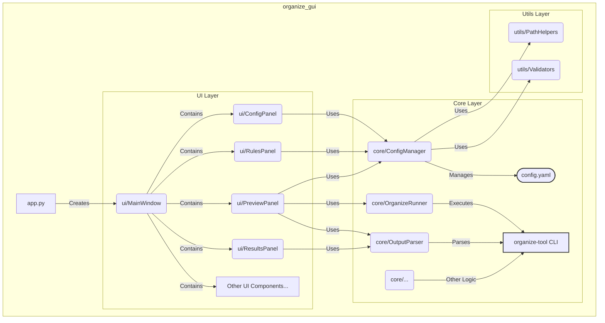
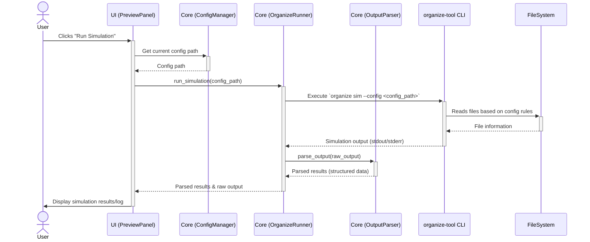

# File Organization System Frontend

This project provides a user-friendly graphical interface for the powerful [organize-tool](https://github.com/tfeldmann/organize) file organization system. Instead of writing YAML configuration files manually, you can organize your files through an intuitive interface.

## Core Features

The application lets you organize files visually by configuring source and destination directories, setting up rules, and previewing changes before they happen. When you run the organization process, you get real-time feedback about what's happening to your files.

The frontend integrates with organize-tool to help you:
- Set up source folders to scan and destination folders for organized files
- Create and enable/disable organization rules through a visual interface
- Preview all changes safely through simulation mode before running them
- Schedule automatic organization to run at specific times
- Track and analyze how your files were organized

## Getting Started

### Requirements

Before installing, make sure you have:
- Python 3.6 or newer
- The organize-tool (`pip install -U organize-tool`)
- Tkinter (usually included with Python)

### Installation

1. Get the code:
   ```bash
   git clone https://github.com/stravos97/organise-files-folders-front-end.git
   cd organize-gui
   ```

2. Install it:
   ```bash
   pip install -e .
   ```

   Or use the included launcher:
   ```bash
   ./run.sh  # On Linux/macOS
   ```
   *(Note: A `run.bat` might be needed for Windows)*

### Quick Usage Guide

1.  **Launch the application:**
    ```bash
    organize-gui
    ```
    Or use the script: `./run.sh`

2.  **Configure your folders in the `Configuration` Tab:**
    *   Choose which folders to scan for files (Source).
    *   Select where organized files should go (Destination).
    *   Load existing or Save your settings.

3.  **Set up rules in the `Rules` Tab:**
    *   View rules loaded from your configuration.
    *   Enable or disable rules using checkboxes.
    *   *(Advanced: Edit rules directly via YAML or dedicated editors)*

4.  **Test your setup in the `Preview & Run` Tab:**
    *   Run a **Simulation** to see what *would* happen without moving files.
    *   Check the log output to ensure files are targeted correctly.
    *   Run the real **Organize** process when ready.
    *   Schedule future runs if needed.

5.  **Review results in the `Results` Tab:**
    *   See a summary and detailed list of what files moved where.
    *   Check for any errors during the process.
    *   Export reports if needed.

## Project Architecture (Overview)

The application uses a clean three-layer architecture to keep the code organized and maintainable:

*   **UI Layer (`ui/`)**: The interface built with Tkinter, including the main window and tabs for Configuration, Rules, Preview, and Results. See files like `ui/main_window.py`, `ui/config_panel.py`, `ui/rules_panel.py`, etc.
*   **Core Layer (`core/`)**: The backend logic, handling configuration (`core/config_manager.py`), running `organize-tool` (`core/organize_runner.py`), and processing its output (`core/output_parser.py`).
*   **Utils Layer (`utils/`)**: Common helper functions for tasks like path handling (`utils/path_helpers.py`) and input validation (`utils/validators.py`).

The entry point `app.py` initializes the application and connects these components.

## How It Works (Overview)

When you use the application, these components work together:

1.  The **Configuration Tab** lets you set up paths, which are managed by the **Config Manager** in the core layer.
2.  The **Rules Tab** shows your organization rules (read by the **Config Manager**) and lets you enable/disable them.
3.  When you run a simulation or organization via the **Preview & Run Tab**:
    *   The **Organize Runner** executes the actual `organize-tool` command.
    *   The **Output Parser** processes the results from the command.
    *   The interface updates to show you the log output and results.
4.  After organization completes, the **Results Tab** displays a summary of what happened.

## License

This project uses the MIT License - see the LICENSE file for details (if one exists in the repository).

## Credits

- [organize-tool](https://github.com/tfeldmann/organize) - The powerful organization engine that makes this possible.

## Creating a Standalone Executable (using PyInstaller)

You can bundle this application into a single executable file so that users don't need to install Python or dependencies. This is done using the `PyInstaller` tool.

**1. Install PyInstaller:**

   Make sure you are in your project's activated virtual environment (the one created by `run.sh` or `run.bat`, or one you manage manually). Then, install PyInstaller:

   ```bash
   pip install pyinstaller
   ```

**2. Run PyInstaller:**

   Navigate to the `organize_gui` directory in your terminal (the directory containing `app.py`). Run the following command:

   ```bash
   # For Windows:
   pyinstaller --onefile --windowed --name organize-gui app.py

   # For macOS/Linux:
   pyinstaller --onefile --windowed --name organize-gui app.py
   ```

   *   `--onefile`: Bundles everything into a single executable.
   *   `--windowed`: Prevents a console window from opening when the GUI app runs. Use `--noconsole` if `--windowed` doesn't work on your system.
   *   `--name organize-gui`: Sets the name of the output executable.
   *   `app.py`: Your main application script.

**3. Find the Executable:**

   PyInstaller will create `build` and `dist` directories. Your standalone executable will be inside the `dist` directory (e.g., `dist/organize-gui.exe` on Windows, `dist/organize-gui` on macOS/Linux).

**Important Notes:**

*   **Platform Specific:** You typically need to run PyInstaller on the target operating system. Build on Windows to create a `.exe`, on macOS for a macOS app bundle, etc.
*   **Troubleshooting:** If the executable fails to run, PyInstaller might have missed some hidden dependencies. You may need to consult the PyInstaller documentation and potentially modify the `.spec` file it generates to include missing modules (`--hidden-import`) or data files (`--add-data`).

---

## Advanced Details & Development

This section provides in-depth technical information about the application's architecture, workflow, and development process.

### Detailed Architecture

The application is structured into distinct layers: UI, Core, and Utilities. It interacts with the external `organize-tool` command-line interface.



-   **`app.py`**: The main entry point. Initializes the Tkinter environment and creates the main application window.
-   **UI Layer (`ui/`)**: Contains all graphical components built with Tkinter/ttk. This includes the main window (`MainWindow`) and various panels (`ConfigPanel`, `RulesPanel`, `PreviewPanel`, `ResultsPanel`) that handle user interaction.
-   **Core Layer (`core/`)**: Houses the application's backend logic.
    -   `ConfigManager`: Handles loading, saving, and manipulating the `organize-tool` YAML configuration file.
    -   `OrganizeRunner`: Responsible for executing the `organize-tool` CLI commands (like `run` or `sim`) as subprocesses and capturing their output.
    -   `OutputParser`: Interprets the text output from `organize-tool` into structured data for display in the UI.
-   **Utils Layer (`utils/`)**: Provides common helper functions, such as path manipulation (`PathHelpers`) and input validation (`Validators`), used across different parts of the application.
-   **`organize-tool` CLI**: The external command-line tool that performs the actual file organization based on the YAML configuration. The GUI acts as a frontend to this tool.

### Detailed Workflow Example: Running Simulation

This diagram shows the sequence of interactions when a user runs the simulation mode:



1.  The **User** clicks the "Run Simulation" button in the **PreviewPanel**.
2.  The **PreviewPanel** asks the **ConfigManager** for the path to the current configuration file.
3.  The **PreviewPanel** instructs the **OrganizeRunner** to start a simulation, passing the configuration path.
4.  The **OrganizeRunner** executes the `organize sim` command as a subprocess, targeting the specified configuration file.
5.  The **`organize-tool` CLI** reads the configuration, scans the **FileSystem** according to the rules defined.
6.  The **CLI** generates output describing the actions it *would* take and sends this back to the **OrganizeRunner**.
7.  The **OrganizeRunner** passes the raw output to the **OutputParser**.
8.  The **OutputParser** processes the text output into a more structured format (e.g., a list of planned actions).
9.  The **OrganizeRunner** returns both the parsed results and the raw log output to the **PreviewPanel**.
10. The **PreviewPanel** updates the UI to display the simulation results and logs to the **User**.

### Detailed Codebase Structure & Component Interaction

The project follows a modular structure designed for separation of concerns:

```
organize_gui/
├── app.py                  # Main application entry point & Tkinter setup
├── ui/                     # User Interface components (Tkinter widgets)
│   ├── main_window.py      # Main application window, holds the notebook/tabs
│   ├── config_panel.py     # UI for setting source/destination paths, loading/saving config
│   ├── rules_panel.py      # UI for viewing, enabling/disabling rules from the config
│   ├── preview_panel.py    # UI for running simulation/actual organization, viewing logs
│   ├── results_panel.py    # UI for displaying results after an organization run
│   ├── output_log_panel.py # Reusable panel for displaying text output/logs
│   ├── rule_details_panel.py # Shows details of a selected rule
│   ├── yaml_editor_panel.py  # Allows direct editing of the YAML config
│   ├── rule_list_manager.py # Helper class to manage the rule list display
│   ├── results_tree_manager.py # Helper class to manage the results tree display
│   └── dialogs/              # Various popup dialogs (About, Schedule, etc.)
├── core/                   # Core application logic (non-UI)
│   ├── config_manager.py   # Handles reading, writing, and parsing the organize-tool YAML config
│   ├── organize_runner.py  # Manages executing organize-tool CLI commands via subprocesses
│   ├── output_parser.py    # Parses the stdout/stderr from organize-tool into structured data
│   ├── preset_manager.py   # (If exists) Manages predefined rule configurations
│   └── duplicate_helpers.py # (If exists) Specific logic for handling duplicates
└── utils/                  # Shared utility functions
    ├── path_helpers.py     # Functions for manipulating file paths
    └── validators.py       # Functions for validating user input (e.g., paths)
```

**How Components Work Together:**

1.  **Initialization (`app.py`)**: Sets up the main Tkinter window (`root`) and instantiates `ui.MainWindow`.
2.  **Main Window (`ui.MainWindow`)**: Creates the main application structure, typically a `ttk.Notebook` (tabs). It initializes and places the different panels (`ConfigPanel`, `RulesPanel`, etc.) into their respective tabs.
3.  **Configuration (`ui.ConfigPanel` & `core.ConfigManager`)**:
    *   The `ConfigPanel` provides widgets (Entry fields, Buttons) for the user to specify paths and load/save configurations.
    *   When the user interacts (e.g., clicks "Load"), the `ConfigPanel` calls methods on `ConfigManager`.
    *   `ConfigManager` handles the file I/O (reading/writing YAML) and keeps the current configuration state. It uses `utils.PathHelpers` or `utils.Validators` if needed.
4.  **Rule Display (`ui.RulesPanel` & `core.ConfigManager`)**:
    *   The `RulesPanel` (often using `ui.RuleListManager`) reads the rules from the `ConfigManager`.
    *   It displays the rules in a list or tree view, allowing users to enable/disable them. Changes are communicated back to `ConfigManager` to update the configuration state.
    *   Selecting a rule might populate `ui.RuleDetailsPanel`.
5.  **Execution (`ui.PreviewPanel`, `core.OrganizeRunner`, `core.OutputParser`)**:
    *   The `PreviewPanel` has buttons like "Run Simulation" or "Run Organize".
    *   Clicking these buttons triggers methods in `OrganizeRunner`, passing the path to the current configuration (obtained from `ConfigManager`).
    *   `OrganizeRunner` launches the `organize-tool` command (e.g., `organize sim` or `organize run`) as a separate process.
    *   It captures the standard output and standard error streams from the process.
    *   The raw output is passed to `OutputParser`, which converts the text log into structured data (like a list of actions or errors).
    *   The parsed data and raw logs are sent back to the `PreviewPanel` (or `ui.OutputLogPanel`) for display to the user.
6.  **Results (`ui.ResultsPanel` & `core.OutputParser` data)**:
    *   After a successful `organize run`, the parsed results from `OutputParser` are used by `ResultsPanel` (often via `ui.ResultsTreeManager`) to display a summary and detailed list of file operations performed.

This separation allows the UI to focus on presentation and user interaction, while the Core handles the logic of managing configurations and interacting with the external `organize-tool`. The Utils provide reusable functions to support both layers.

### Customization

The application is designed to be easily customizable:

- Add new tabs or panels by extending the UI components in the `ui/` directory.
- Add new validator functions in `utils/validators.py` for additional input checks.
- Modify or extend the `core/ConfigManager` to handle different configuration structures or defaults.
- Enhance the `core/OutputParser` to extract more information from the `organize-tool` output.

### Development Guide: Building Organize GUI Step-by-Step

This guide outlines the conceptual steps involved in creating the `organize-gui` application.

**1. Foundation & Setup**

*   **Goal:** Create a user-friendly graphical interface for the powerful `organize-tool` command-line utility.
*   **Technology Choice:** Python for the core logic and its built-in Tkinter library (specifically `tkinter.ttk` for themed widgets) for the GUI, ensuring cross-platform compatibility with minimal external dependencies for the UI itself. `PyYAML` is needed for config handling.
*   **Project Structure:**
    *   Create the main directory: `organize_gui/`
    *   Add core Python files: `app.py` (entry point), `setup.py` (packaging), `__init__.py`.
    *   Add helper scripts: `run.sh` (Linux/macOS launcher), potentially `run.bat` (Windows).
    *   Create subdirectories for modularity: `ui/`, `core/`, `utils/`. Add `__init__.py` to each to make them Python packages.
    *   Start `README.md` for documentation.
*   **Initial `app.py`:**
    *   Import `tkinter` and `tkinter.ttk`.
    *   Create the main `tk.Tk()` root window.
    *   Set the window title and initial size (`root.geometry(...)`).
    *   Apply a `ttk.Style` (e.g., 'clam') for a modern look.
    *   Define the `main()` function and the `if __name__ == "__main__":` block.
    *   Initially, just call `root.mainloop()` to show an empty window.

**2. Core Logic Implementation (`core/`)**

*   **`core/config_manager.py`:**
    *   Import `yaml`.
    *   Create a class `ConfigManager`.
    *   Implement `load_config(filepath)`: Reads YAML file using `yaml.safe_load()`, stores data (e.g., in `self.config_data`). Handles file not found errors.
    *   Implement `save_config(filepath)`: Writes `self.config_data` to YAML using `yaml.dump()`.
    *   Implement methods to get/set specific parts of the config (e.g., `get_rules()`, `update_rule_status(...)`).
*   **`core/organize_runner.py`:**
    *   Import `subprocess`, `threading`, `queue`.
    *   Create a class `OrganizeRunner`.
    *   Implement `run_command(command_args, callback)`:
        *   Uses `subprocess.Popen` to run `organize-tool` commands (like `['organize', 'sim', '--config', config_path]`).
        *   Set `stdout=subprocess.PIPE`, `stderr=subprocess.PIPE`, `text=True`, `bufsize=1`.
        *   Use separate threads (`threading.Thread`) to read stdout and stderr line by line without blocking the GUI.
        *   Put lines read into a `queue.Queue`.
        *   Use `root.after()` or another mechanism to periodically check the queue from the main GUI thread and send updates to a `callback` function (e.g., in the UI panel).
        *   Handle process completion and potential errors.
    *   Implement specific methods like `run_simulation(config_path, callback)` and `run_organize(config_path, callback)` that call `run_command` with the correct arguments.
*   **`core/output_parser.py`:**
    *   Create functions or a class to parse the raw text output from `organize-tool`.
    *   Use string manipulation or regular expressions (`re` module) to identify key information (e.g., rule names, files being processed, actions taken, errors).
    *   Convert this information into structured data (e.g., lists of dictionaries) that the UI can easily display. Example: `{'type': 'action', 'rule': 'Move PDFs', 'action': 'move', 'path': '...', 'dest': '...'}`.

**3. Basic UI Structure (`ui/`)**

*   **`ui/main_window.py`:**
    *   Create a class `MainWindow` inheriting from `ttk.Frame`.
    *   Initialize the main `ttk.Notebook` widget in the `__init__`.
    *   Create placeholder frames for each tab: `config_frame`, `rules_frame`, `preview_frame`, `results_frame`.
    *   Add these frames as tabs to the notebook: `notebook.add(config_frame, text='Configuration')`, etc.
    *   Pack the notebook to fill the main window.
*   **Update `app.py`:** Import `MainWindow` and instantiate it within the `main` function, passing the `root` window.

**4. Building UI Panels Step-by-Step (`ui/`)**

*   **`ui/config_panel.py`:**
    *   Create `ConfigPanel` class (inheriting `ttk.Frame`).
    *   Add `ttk.Label`, `ttk.Entry`, and `ttk.Button` widgets for source path, destination path, load, save. Use `grid()` or `pack()` for layout.
    *   Instantiate `core.ConfigManager`.
    *   Implement button command functions:
        *   `load_config()`: Opens a file dialog (`tkinter.filedialog.askopenfilename`), calls `config_manager.load_config()`, updates entry fields, and potentially triggers updates in other panels (e.g., RulesPanel).
        *   `save_config()`: Opens a save dialog (`tkinter.filedialog.asksaveasfilename`), calls `config_manager.save_config()`.
        *   Bind entry field changes to update the `config_manager` state if needed.
*   **`ui/rules_panel.py`:**
    *   Create `RulesPanel` class.
    *   Add a `ttk.Treeview` widget to display rules. Configure columns (e.g., "Name", "Enabled", "Locations", "Filters", "Actions").
    *   Implement a `load_rules()` method: Gets rules from `ConfigManager`, clears the treeview, and inserts each rule as an item. Use tags or checkboxes for the "Enabled" status.
    *   Handle treeview selection events to potentially show rule details in another panel (`RuleDetailsPanel`).
    *   Handle checkbox toggles to update the rule status via `ConfigManager`.
*   **`ui/preview_panel.py`:**
    *   Create `PreviewPanel` class.
    *   Add `ttk.Button` for "Run Simulation" and "Run Organize".
    *   Add a text area (e.g., using `tkinter.Text` or a custom `OutputLogPanel`) for logs.
    *   Instantiate `core.OrganizeRunner` and `core.OutputParser`.
    *   Implement button command functions:
        *   `run_simulation()`: Gets config path from `ConfigManager`, calls `organize_runner.run_simulation()`, passing a callback method (`self.update_log`).
        *   `run_organize()`: Similar, but calls `organize_runner.run_organize()`.
    *   Implement `update_log(line)`: Appends the received line to the text area. Potentially calls `output_parser` as lines come in or when the process finishes.
*   **`ui/results_panel.py`:**
    *   Create `ResultsPanel` class.
    *   Add a `ttk.Treeview` for displaying structured results.
    *   Implement `display_results(parsed_data)`: Clears the treeview and populates it with the actions performed, based on the data received from `OutputParser` after a successful `organize run`.

**5. Utilities (`utils/`)**

*   **`utils/path_helpers.py`:** Create functions like `browse_directory()` or `browse_file()` that use `tkinter.filedialog` to simplify path selection in UI panels.
*   **`utils/validators.py`:** Create functions like `is_valid_path(path)` to check if user input is reasonable before passing it to core components.

**6. Connecting UI and Core**

*   **Dependency Injection/Shared Instances:** Pass instances of core components (like `ConfigManager`) to the UI panels that need them during initialization in `MainWindow`.
*   **Callbacks:** Use callback functions (as shown in `OrganizeRunner`) for core components to send data back to the UI asynchronously without direct coupling.
*   **Observer Pattern (Optional):** For more complex state management, consider implementing an observer pattern where UI panels register interest in changes within core components (like `ConfigManager`) and get notified automatically.

**7. Refinements**

*   **Error Handling:** Add `try...except` blocks in core logic (file I/O, subprocess execution) and display errors gracefully in the UI (e.g., using `tkinter.messagebox`).
*   **Dialogs (`ui/dialogs/`):** Create separate modules for dialogs like "About", "Settings", "Schedule".
*   **Menus:** Add a main menu bar (`tk.Menu`) to the root window for common actions (File > Load/Save, Help > About).
*   **Threading:** Ensure long-running tasks (like `organize run`) don't freeze the GUI by using threads (as done in `OrganizeRunner`). Remember that Tkinter UI updates must happen in the main thread (use `root.after` or thread-safe queues).

**8. Packaging**

*   **`setup.py`:** Define package metadata, dependencies (`pyyaml`, `organize-tool`), and entry points (`console_scripts`) so the application can be installed via `pip install -e .` and run using the `organize-gui` command.
*   **`run.sh` / `run.bat`:** Provide simple scripts to activate a virtual environment (if needed) and run `python app.py`, making it easy for users to start the application directly from the source directory.

This step-by-step process builds the application incrementally, starting with the core logic and progressively adding UI layers and features.
